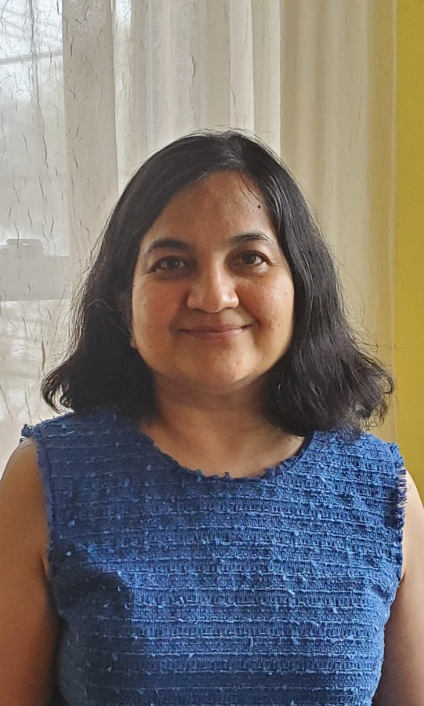

## About me

<html>
 
</html>

Hello! Welcome to my website. I currently serve as Dean of Science, Technology, Engineering, and Math at MassBay Community College. I am passionate about teaching, mentoring, and writing about current issues in my professional field. I lead with empathy and care. I earned my Ph.D. in Civil (Structural) Engineering from Tufts University in 2004. 

In my free time, I enjoy baking, gardening, walking, and reading.   

For more information, check out [my LinkedIn page](https://www.linkedin.com/in/chitra-javdekar-deshpande-097781b/).

